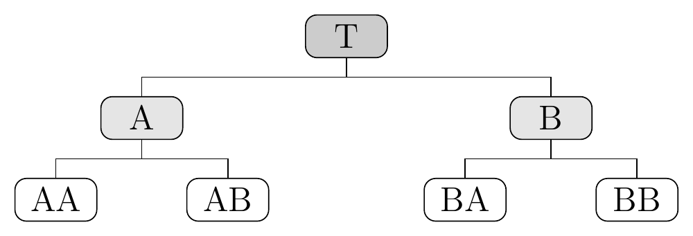
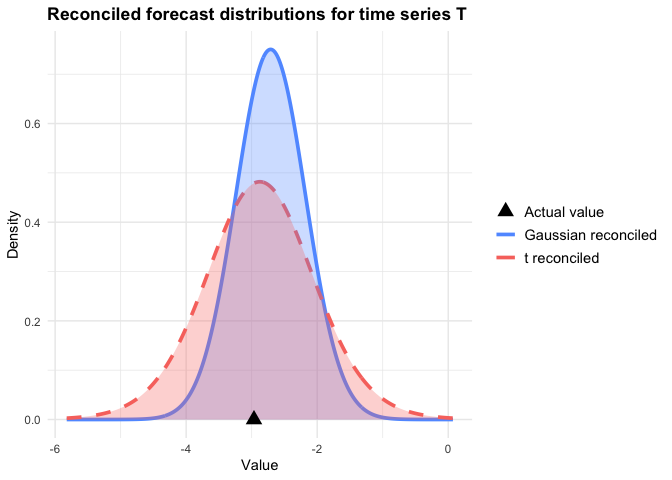
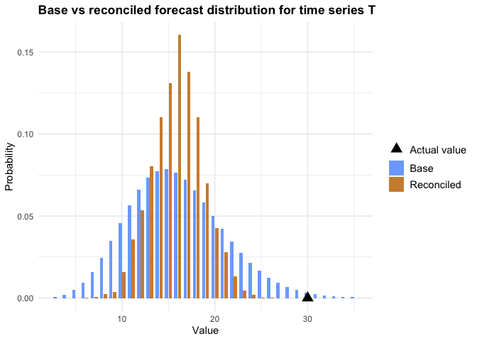
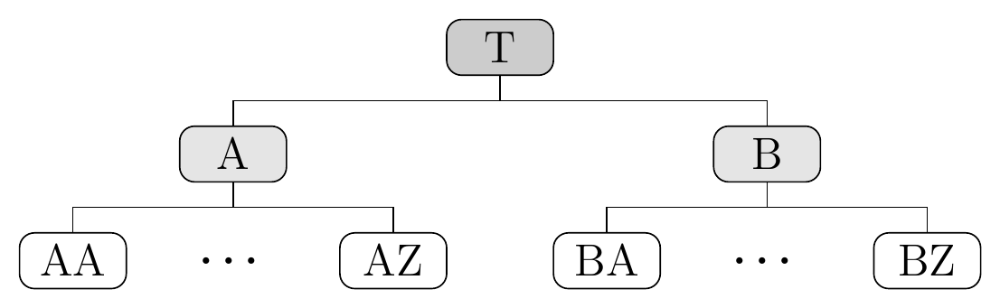
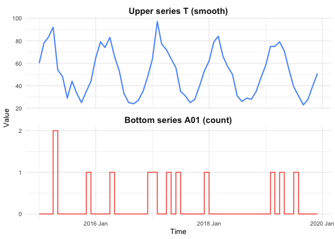
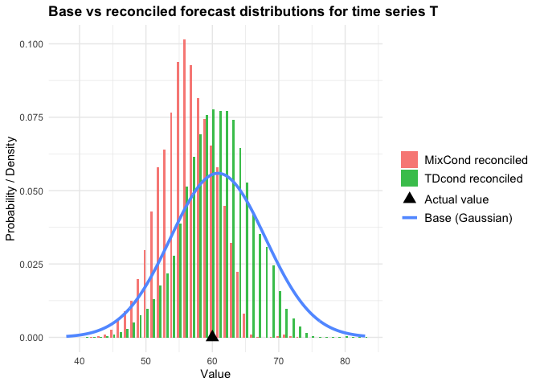

<!-- README.md is generated from README.Rmd. Please edit that file -->

# fable.bayesRecon: BAyesian reCONciliation in the fable framework <a href="https://idsia.github.io/bayesRecon/"></a>

<!-- badges: start -->

[](https://github.com/dazzimonti/fable.bayesRecon/actions/workflows/R-CMD-check.yaml)
[](https://CRAN.R-project.org/package=fable.bayesRecon)
[](https://lifecycle.r-lib.org/articles/stages.html#experimental)
[](https://coveralls.io/github/dazzimonti/fable.bayesRecon?branch=main)
[-yellow.svg)](https://www.gnu.org/licences/lgpl-3.0)
[](https://github.com/dazzimonti/fable.bayesRecon/actions/workflows/R-CMD-check.yaml)
<!-- badges: end -->

The package `fable.bayesRecon` integrates the probabilistic
reconciliation methods from
[`bayesRecon`](https://github.com/IDSIA/bayesRecon) into the
[`fable`](https://fable.tidyverts.org/) /
[`fabletools`](https://fabletools.tidyverts.org/) framework.
Reconciliation is specified via the `reconcile()` verb and produced when
`forecast()` is called, following the same tidy workflow used by
`fable`.

The reconciliation functions are:

- `bayesRecon_t`: reconciliation via conditioning with uncertain
  covariance matrix; the reconciled forecasts are multivariate
  Student-t; this is done analytically.
- `bayesRecon_BUIS`: reconciliation via conditioning of any
  probabilistic forecast via importance sampling; this is the
  recommended option for non-Gaussian base forecasts;
- `bayesRecon_MixCond`: reconciliation via conditioning of mixed
  hierarchies, where the upper forecasts are multivariate Gaussian and
  the bottom forecasts are discrete distributions;
- `bayesRecon_TDcond`: reconciliation via top-down conditioning of mixed
  hierarchies, where the upper forecasts are multivariate Gaussian and
  the bottom forecasts are discrete distributions;

## News

:boom: \[2026-05-05\] fable.bayesRecon v0.1.0: first CRAN release.

## Installation

You can install the **stable** version on [R
CRAN](https://cran.r-project.org/package=fable.bayesRecon)

``` r
install.packages("fable.bayesRecon", dependencies = TRUE)
```

You can install the **development** version from
[GitHub](https://github.com/dazzimonti/fable.bayesRecon):

``` r
# install.packages("devtools")
devtools::install_github("dazzimonti/fable.bayesRecon", build_vignettes = TRUE, dependencies = TRUE)
```

## Usage

The package follows the standard `fable` workflow:

1.  Prepare data as a `tsibble` and define the hierarchy with
    `aggregate_key()`.
2.  Fit base forecasting models with `model()`.
3.  Specify the reconciliation strategy inside `reconcile()`.
4.  Produce reconciled probabilistic forecasts with `forecast()`.

We provide in [the vignette
fable.bayesRecon](https://cran.r-project.org/web/packages/fable.bayesRecon/vignettes/fable.bayesRecon.html)
a simple usage example; refer to the package documentation for more
details on the reconciliation methods and their parameters. See the book
Hyndman and Athanasopoulos (2021) for a general introduction to
forecasting with `fable` and `fabletools`.

## Getting help

If you encounter a bug, please file a minimal reproducible example on
[GitHub](https://github.com/dazzimonti/fable.bayesRecon/issues).

## Examples from `bayesRecon`

In this section we reproduce the examples found `bayesRecon`’s Readme
file in the fable framework. You can use this section as a guiding
example to convert your code from `bayesRecon` to `fable.bayesRecon`.

### Example 1: Gaussian forecast distributions



<br />

Let us consider a hierarchy with 4 bottom time series and 3 upper time
series, as shown in the figure above.

In this example, we assume that the base forecasts are multivariate
Gaussian, which is a common choice for real-valued time series.

To generate the hierarchical time series, we first randomly simulate the
bottom series using an AR(1) process and then aggregate them using the
function `aggregate_key` from `fabletools`.

``` r
library(tsibble)
library(fabletools)
library(dplyr)
set.seed(1234)

# Simulate the 4 bottom series from independent AR(1) processes. The bottom
# series are indexed by two nested keys (major/minor), matching the hierarchy
# Total -> {A, B} -> {AA, AB, BA, BB} encoded in A above. The time index is
# monthly, starting in January 2015.
n_obs <- 12  # length of the time series
month_idx <- yearmonth("2015 Jan") + 0:(n_obs - 1)
bottom_keys <- expand.grid(minor = c("A", "B"), major = c("A", "B"))

bottom_data <- data.frame(
  Month = rep(month_idx, times = nrow(bottom_keys)),
  major = rep(bottom_keys$major, each = n_obs),
  minor = rep(bottom_keys$minor, each = n_obs),
  value = as.numeric(sapply(seq_len(nrow(bottom_keys)), function(j)
    arima.sim(model = list(ar = 0.8), n = n_obs, sd = 0.5)))
) |>
  as_tsibble(index = Month, key = c(major, minor))

# Aggregate to obtain the upper series (Total, and majors A/B)
data <- bottom_data |>
  aggregate_key(major/minor, value = sum(value))
```

We compute the base forecasts using an ETS model with Gaussian
predictive distribution. We then analytically compute the reconciled
forecasts via conditioning using the `fable::min_trace` and the
`fable.bayesRecon::bayesRecon_t` functions. The reconciled forecasts
produced by `min_trace` are multivariate Gaussian, and they are
equivalent to Gaussian reconciliation via conditioning ([Zambon et
al. 2024](https://doi.org/10.1016/j.ijforecast.2023.12.004)). The
`bayesRecon_t` method adopts a Bayesian approach to account for the
uncertainty of the covariance matrix of the base forecasts; the
reconciled forecasts, which are multivariate Student-t, are typically
better calibrated (see [Carrara et
al. 2025](https://arxiv.org/abs/2506.19554) for details).

``` r
library(fable)
library(fable.bayesRecon)

fit <- data |>
  model(base = ETS(value)) |> # fit ETS model
  reconcile(t = bayesRecon_t(base,freq =1),                 # Reconcile with t-Rec
            mint = min_trace(base))                         # Reconcile with MinT

fit |> knitr::kable()
```

| major        | minor        | base           | t              | mint           |
|:-------------|:-------------|:---------------|:---------------|:---------------|
| A            | A            | \<ETS(A,N,N)\> | \<ETS(A,N,N)\> | \<ETS(A,N,N)\> |
| A            | B            | \<ETS(A,N,N)\> | \<ETS(A,N,N)\> | \<ETS(A,N,N)\> |
| A            | <aggregated> | \<ETS(A,N,N)\> | \<ETS(A,N,N)\> | \<ETS(A,N,N)\> |
| B            | A            | \<ETS(A,N,N)\> | \<ETS(A,N,N)\> | \<ETS(A,N,N)\> |
| B            | B            | \<ETS(A,N,N)\> | \<ETS(A,N,N)\> | \<ETS(A,N,N)\> |
| B            | <aggregated> | \<ETS(A,N,N)\> | \<ETS(A,N,N)\> | \<ETS(A,N,N)\> |
| <aggregated> | <aggregated> | \<ETS(A,N,N)\> | \<ETS(A,N,N)\> | \<ETS(A,N,N)\> |

For simplicity, we only compute one-step-ahead forecasts, by changing
the value in the parameter `h` below we can compute multi-step-ahead
forecasts with the same code.

``` r
fc <- fit |>
  forecast(h = "1 month")
```

The table below compares the point forecasts (mean of the forecast
distribution) obtained with the three methods for each level.

| .model |     T |     A |     B |    AA |    AB |    BA |    BB |
|:-------|------:|------:|------:|------:|------:|------:|------:|
| base   | -2.64 | -2.24 | -0.35 | -2.06 | -0.18 | -0.19 | -0.47 |
| mint   | -2.71 | -2.23 | -0.48 | -2.06 | -0.17 | -0.14 | -0.35 |
| t      | -2.88 | -2.37 | -0.50 | -2.02 | -0.36 | -0.11 | -0.39 |

Finally, we compare the reconciled forecast distributions for the top
series T obtained with the two methods by plotting their marginal
densities.



### Example 2: discrete forecast distributions

We consider the same hierarchy of Example 1; however, we assume that the
base forecasts are discrete, which is a common choice for count time
series.

We simulate the bottom series by drawing from Poisson distributions with
time-varying rates that include a monthly seasonal pattern, and
aggregate them with `aggregate_key`, exactly as in Example 1.

``` r
set.seed(123)
n_obs <- 60
month_idx <- yearmonth("2015 Jan") + 0:(n_obs - 1)
bottom_keys <- expand.grid(minor = c("A", "B"), major = c("A", "B"))

# Baseline Poisson rates for the bottom series (AA, AB, BA, BB) and a shared
# monthly seasonal term (period = 12)
lambda_bls <- c(3, 4, 5, 6)
seas <- 1.5 * sin(2 * pi * (1:n_obs) / 12)

bottom_data <- data.frame(
  Month = rep(month_idx, times = nrow(bottom_keys)),
  major = rep(bottom_keys$major, each = n_obs),
  minor = rep(bottom_keys$minor, each = n_obs),
  value = as.numeric(sapply(seq_len(nrow(bottom_keys)), function(j) {
    lambda_j <- lambda_bls[j] + seas + rnorm(n_obs, sd = 0.1)  # add small noise to the rate
    rpois(n_obs, lambda_j)
  }))
) |>
  as_tsibble(index = Month, key = c(major, minor))

# Aggregate to obtain the upper series (Total, and majors A/B)
data <- bottom_data |>
  aggregate_key(major/minor, value = sum(value))
```

We compute the base forecasts using the `GAMPOISB` model from
[`fable.intermittent`](https://cran.r-project.org/package=fable.intermittent),
which is specific for count time series. Note that, unlike `ETS`,
`GAMPOISB` does not currently support exogenous regressors or a
`season()` term in its formula, so it cannot explicitly track the
seasonal pattern used to generate the data above; it still produces a
valid predictive distribution for each series.

We then compute the reconciled forecasts using the Bottom-Up Importance
Sampling (BUIS) algorithm, via `fable.bayesRecon::bayesRecon_BUIS` (see
[Zambon et al. 2024](https://doi.org/10.1007/s11222-023-10343-y) for
details). BUIS reconciles any probabilistic base forecast via importance
sampling, and is the recommended choice for discrete (or otherwise
non-Gaussian) base forecasts. The reconciled forecasts it produces are
represented as samples (`distributional::dist_sample`), from which any
desired summary (mean, quantiles, etc.) can be computed.

``` r
library(fable.intermittent)

fit <- data |>
  model(base = GAMPOISB(value)) |>          # fit GAMPOISB for the full hierarchy
  reconcile(buis = bayesRecon_BUIS(base))   # reconcile with BUIS
```

For simplicity, we only compute one-step-ahead forecasts, by changing
the value in the parameter `h` below we can compute multi-step-ahead
forecasts with the same code.

``` r
fc <- fit |>
  forecast(h = "1 month")
```

The tables below compare, for each series in the hierarchy, the mean and
the 80%/95% quantiles of the base and reconciled forecast distributions
(one row per model, one column per series).

**Mean**

| .model |     T |    A |    B |   AA |   AB |   BA |   BB |
|:-------|------:|-----:|-----:|-----:|-----:|-----:|-----:|
| base   | 16.02 | 7.56 | 8.67 | 2.92 | 4.10 | 4.90 | 5.56 |
| buis   | 15.88 | 6.60 | 9.28 | 2.77 | 3.83 | 4.31 | 4.97 |

**80% quantile**

| .model |   T |   A |   B |  AA |  AB |  BA |  BB |
|:-------|----:|----:|----:|----:|----:|----:|----:|
| base   |  20 |  10 |  11 |   4 |   6 |   7 |   7 |
| buis   |  18 |   8 |  11 |   4 |   5 |   6 |   6 |

**95% quantile**

| .model |   T |   A |   B |  AA |  AB |  BA |  BB |
|:-------|----:|----:|----:|----:|----:|----:|----:|
| base   |  25 |  14 |  15 |   6 |   8 |   9 |  10 |
| buis   |  20 |  10 |  13 |   5 |   7 |   7 |   8 |

Finally, we compare the base and reconciled forecast distributions for
the top series T, by evaluating the `distributional` generics
`quantile()` and `density()` on the returned forecast distributions.



### Example 3: mixed-type forecast distributions

In many large hierarchies the bottom series are low-count integers
(e.g., item-level sales), while the upper series can be considered as
real-valued due to the smoothing effect of aggregation (e.g., total
sales). These hierarchies are often referred to as *mixed*, since
forecasts for the bottom series are discrete distributions, while
forecasts for the upper series are continuous distributions. The
functions `bayesRecon_MixCond` and `bayesRecon_TDcond` handle this mixed
case: the bottom series are fit with a discrete-distribution model and
the upper series with a continuous (Gaussian) model. These functions
implement different methods for reconciling mixed hierarchies; we
recommend using `bayesRecon_MixCond` for moderately sized hierarchies
and `bayesRecon_TDcond` for large hierarchies (see [Zambon et
al. 2024](https://proceedings.mlr.press/v244/zambon24a.html) for
details).

Let us consider a hierarchy with 3 upper series and 52 bottom series
arranged in 2 groups of 26:



<br />

We randomly generate the bottom count time series as in Example 2, using
a major/minor nested key: `major` has 2 levels (2 groups) and `minor`
has 26 levels (items) nested within each major, giving 1 Total + 2
majors + 52 leaves = 3 upper and 52 bottom series, matching the figure
above.

``` r
set.seed(12)
n_obs <- 60
month_idx <- yearmonth("2015 Jan") + 0:(n_obs - 1)
# 2 majors (groups) x 26 minors (items) = 52 bottom series
bottom_keys <- expand.grid(minor = sprintf("%02d", 1:26), major = c("A", "B"))
n_b <- nrow(bottom_keys)

# Assume a Poisson data generating process with a shared monthly seasonality
lambda_levels <- runif(n_b, min = 0.1, max = 2)  # per-series baseline rates
seas <- 1 + .5 * sin(2 * pi * (1:n_obs) / 12)    # shared seasonal multiplier

bottom_data <- data.frame(
  Month = rep(month_idx, times = n_b),
  major = rep(bottom_keys$major, each = n_obs),
  minor = rep(bottom_keys$minor, each = n_obs),
  value = as.numeric(sapply(seq_len(n_b), function(j)
    rpois(n_obs, lambda_levels[j] * seas)))
) |>
  as_tsibble(index = Month, key = c(major, minor))

# Aggregate to obtain the upper series (Total, and majors A/B)
data <- bottom_data |>
  aggregate_key(major/minor, value = sum(value))
```

We show a comparison of upper and bottom time series. Even though the
bottom series are made of low counts, the upper series can be considered
as real-valued due to the smoothing effect of aggregation.



We compute the one-step-ahead base forecasts for the upper series with
an ETS model (Gaussian predictive distribution) and for the bottom
series with the `GAMPOISB` model from `fable.intermittent`, as in
Example 2. Contrary to the previous examples, here the two levels are
fit separately, selecting upper vs. bottom via `is_aggregated(minor)`,
and the two model tables are combined with `dplyr::bind_rows()`.

``` r
library(fable.intermittent)

fit_upper <- data |>
  filter(is_aggregated(minor)) |>
  model(base = ETS(value))          # Gaussian ETS model for the upper series

fit_bottom <- data |>
  filter(!is_aggregated(minor)) |>
  model(base = GAMPOISB(value))     # GAMPOISB model for the bottom (count) series

fit <- dplyr::bind_rows(fit_upper, fit_bottom)
```

We reconcile using both `bayesRecon_MixCond` (importance-sampling based
conditioning) and `bayesRecon_TDcond` (top-down conditioning). These
functions implement different methods for reconciling mixed hierarchies,
but they share the same interface. Both methods estimate the covariance
of the upper base forecasts internally, via shrinkage estimation
(`bayesRecon::schaferStrimmer_cov`) applied to the in-sample residuals
of the fitted upper models.

``` r
fit <- fit |>
  reconcile(
    mixcond = bayesRecon_MixCond(base),
    tdcond  = bayesRecon_TDcond(base)
  )
```

For simplicity, we only compute one-step-ahead forecasts.

``` r
fc <- fit |>
  forecast(h = "1 month")
```

The reconciled forecasts produced by `bayesRecon_MixCond` and
`bayesRecon_TDcond` are represented as samples
(`distributional::dist_sample`); from these we can compute any desired
summary using the usual `distributional` generics. The tables below
compare the mean and the 95% quantile of the base and reconciled
forecast distributions for the upper series T, A and B (one row per
model, one column per series).

**Mean**

| .model  |     T |     A |     B |
|:--------|------:|------:|------:|
| base    | 60.84 | 26.66 | 33.98 |
| mixcond | 56.33 | 23.52 | 32.81 |
| tdcond  | 60.67 | 26.67 | 34.00 |

**95% quantile**

| .model  |     T |     A |     B |
|:--------|------:|------:|------:|
| base    | 72.58 | 36.11 | 39.59 |
| mixcond | 63.00 | 29.00 | 37.00 |
| tdcond  | 69.00 | 33.00 | 39.00 |

Finally, we compare the base forecast and the two reconciled forecast
distributions for the top series T. The base distribution is Gaussian
(line, from the ETS model); the reconciled distributions are discrete
(bars, evaluated via the `distributional` generics on the sample-based
reconciled forecasts). The black triangle indicates the actual value of
T. We refer to [Zambon et
al. 2024](https://proceedings.mlr.press/v244/zambon24a.html) for a
detailed comparison of the two methods for reconciling mixed hierarchies
of different sizes.



## References

Carrara, C., Corani, G., Azzimonti, D., Zambon, L. (2025). *Modeling the
uncertainty on the covariance matrix for probabilistic forecast
reconciliation*. arXiv preprint arXiv:2506.19554. [Available
here](https://arxiv.org/abs/2506.19554)

Hyndman, R.J., & Athanasopoulos, G. (2021). *Forecasting: principles and
practice*. 3rd edition, OTexts: Melbourne, Australia.
[OTexts.com/fpp3](https://OTexts.com/fpp3/). Accessed on 05/05/2026.

Zambon, L., Azzimonti, D. & Corani, G. (2024). *Efficient probabilistic
reconciliation of forecasts for real-valued and count time series*.
Statistics and Computing 34 (1), 21.
[DOI](https://doi.org/10.1007/s11222-023-10343-y)

Zambon, L., Azzimonti, D., Rubattu, N., Corani, G. (2024).
*Probabilistic reconciliation of mixed-type hierarchical time series*.
Proceedings of the Fortieth Conference on Uncertainty in Artificial
Intelligence, PMLR 244:4078-4095. [Available
here](https://proceedings.mlr.press/v244/zambon24a.html)

## Contributors

<!-- prettier-ignore-start -->

<!-- markdownlint-disable -->

<table>

<tbody>

<tr>

<td align="center" valign="top" width="14.28%">

<a href="https://dazzimonti.github.io/">
<br />
<sub><b>Dario Azzimonti</b></sub></a><br />
<sub>(Maintainer)</sub><br />
<a href="mailto:dario.azzimonti@gmail.com?subject=[fable.bayesRecon package]">Email</a>
</td>

<td align="center" valign="top" width="14.28%">

<a href="#">
<br />
<sub><b>Stefano Damato</b></sub></a><br /> <sub> </sub><br />
<a href="mailto:stefano.damato@idsia.ch?subject=[fable.bayesRecon package]">Email</a>
</td>

<td align="center" valign="top" width="14.28%">

<a href="#">
<br />
<sub><b>Lorenzo Zambon</b></sub></a><br /> <sub> </sub><br />
<a href="mailto:lorenzo.zambon@idsia.ch?subject=[fable.bayesRecon package]">Email</a>
</td>

<td align="center" valign="top" width="14.28%">

<a href="#">
<br />
<sub><b>Chiara Carrara</b></sub></a><br /> <sub> </sub><br />
<a href="mailto:chiara.carrara03@universitadipavia.it?subject=[fable.bayesRecon package]">Email</a>
</td>

<td align="center" valign="top" width="14.28%">

<a href="https://sites.google.com/site/awerbhjkl678214/home">
<br />
<sub><b>Giorgio Corani</b></sub></a><br /> <sub> </sub><br />
<a href="mailto:giorgio.corani@idsia.ch?subject=[fable.bayesRecon package]">Email</a>
</td>

</tr>

</tbody>

</table>

<!-- markdownlint-restore -->

<!-- prettier-ignore-end -->
